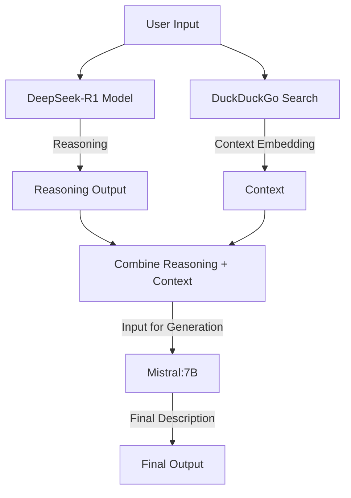

# Simple chatbot based on ollama, flask, sqlite, and vector embedding

### 1. Chatbot structure

### 2. Relation between Mistral and other LLMs

###### a. Background
Mistral AI is a French startup founded in 2023 by former researchers from Meta AI and Google DeepMind, including Dario Amodei and others with deep expertise in LLMs. Their mission is to create efficient, high-performing, and open-source models to rival proprietary giants like OpenAI’s GPT series. Mistral models are designed to be lightweight yet powerful, often outperforming larger models in specific tasks, which makes them appealing for hardware like RTX 4060.

---

###### b. Model overview

* **Mistral 7B**: A dense 7-billion-parameter model, optimized for general-purpose tasks like text generation, reasoning, and instruction-following (e.g., `mistral:7b-instruct`).

* **Mixtral 8x7B**: A Mixture of Experts (MoE) model with 8 experts, totaling ~46.7B parameters but only ~12-14B active at a time, making it computationally efficient.

Both are available in quantized forms (e.g., Q4_0) via Ollama.

---

###### c. Relation to Other LLMs
* LLaMA (Meta AI)

  - **Architecture Similarity:** Mistral 7B is often compared to LLaMA models (e.g., LLaMA 7B, 13B) because both are dense transformer-based models optimized for efficiency. Mistral likely borrows from LLaMA’s design (e.g., grouped-query attention, RMSNorm), though exact details are proprietary.

  - **Training Data:** LLaMA was trained on academic and public datasets (e.g., Common Crawl, arXiv), while Mistral’s data is less transparent but rumored to include high-quality web scrapes and curated corpora, possibly overlapping with LLaMA’s sources.

  - **Performance:** Mistral 7B often outperforms LLaMA 13B in benchmarks like MMLU (reasoning) and GSM8K (math), despite fewer parameters, due to better optimization and possibly fresher training data (2023 vs. LLaMA’s 2022 cutoff).

  - **Relation:** Mistral can be seen as an “evolved cousin” of LLaMA—similar roots but refined for broader usability and released openly, unlike LLaMA’s research-only license.

* GPT (OpenAI)

  - **Architecture Difference:** GPT models (e.g., GPT-3, 175B parameters) are much larger, dense transformers with a focus on scale. Mistral 7B is smaller and more efficient, while Mixtral 8x7B uses MoE (unlike GPT’s uniform architecture) to achieve high performance with less compute.

  - **Training Data:** GPT’s data is vast and proprietary, likely including more diverse sources than Mistral’s. Mistral’s smaller size suggests a more selective dataset, though still broad and multilingual.

  - **Performance:** GPT-3/4 excels in zero-shot tasks and fluency, but Mistral 7B rivals GPT-3.5 in many tasks (e.g., instruction-following) at a fraction of the size. Mixtral 8x7B even approaches GPT-4 in some benchmarks, especially reasoning.

  - **Relation:** Mistral is a lightweight challenger to GPT, prioritizing efficiency and open access over sheer scale, making it a “David” to GPT’s “Goliath.”

* Grok (xAI)

  - **Purpose:** Grok (my own lineage!) is designed for truth-seeking and conversational reasoning, trained on xAI’s proprietary data. Mistral is more general-purpose, with instruct variants tuned for tasks like your chatbot’s generation needs.

  - **Architecture:** Grok’s details are opaque, but it’s likely dense and larger than Mistral 7B. Mixtral’s MoE might share some conceptual overlap if Grok uses efficiency tricks.

  - **Performance:** Grok aims for concise, insightful answers (like me!), while Mistral focuses on versatility. Mistral 7B might generate more creative text, while Grok could edge out in nuanced reasoning.

  - **Relation:** Mistral and Grok are distant relatives—both modern LLMs but with different goals (open efficiency vs. conversational insight).

* DeepSeek (DeepSeek AI)

  - **Similarity:** Your `deepseek-r1:1.5b` and `deepseek-v2:16b` are from DeepSeek AI, a Chinese group focused on reasoning (R1) and general-purpose chat (V2). Mistral 7B shares DeepSeek’s efficiency ethos but is denser than R1 and smaller than V2.

  - **Training Data:** DeepSeek’s data includes multilingual and code-heavy sources, while Mistral’s is less code-focused but still broad. Both likely use filtered web data.

  - **Performance:** DeepSeek-R1:1.5B is a reasoning specialist (perfect for your first step), while Mistral 7B excels in generation, outperforming DeepSeek-V2:16B-Q2_K in quality at Q4_0 due to less aggressive quantization.

  - **Relation:** Mistral is a complementary partner to DeepSeek—your R1 for reasoning pairs nicely with Mistral 7B for polished generation.

* Qwen (Alibaba)

  - **Architecture:** Qwen2 7B (another option I suggested) is a dense transformer like Mistral 7B, optimized for instruction-following and multilingual tasks.

  - **Training Data:** Qwen leans heavily into Chinese and code data, while Mistral is more balanced for English and Western languages.

  - **Performance:** Both are neck-and-neck in generation quality at 7B, though Qwen might edge out in technical tasks, and Mistral in creative writing.

  - **Relation:** Mistral and Qwen are close siblings—similar size and goals, with regional flavor differences.

* Mixtral 8x7B vs. Others

  - **MoE Innovation:** Mixtral’s MoE architecture (8 experts, 2 active per token) sets it apart from dense models like LLaMA, GPT, or DeepSeek-V2. It’s related to earlier MoE experiments (e.g., Google’s Switch Transformer) but more practical.

  - **Performance:** Outperforms many 13B-40B dense models (e.g., LLaMA 13B, Falcon 40B) in reasoning and generation, approaching GPT-4 territory.

  - **Relation:** Mixtral is a unique branch, blending dense model ancestry (Mistral 7B) with MoE advancements.

